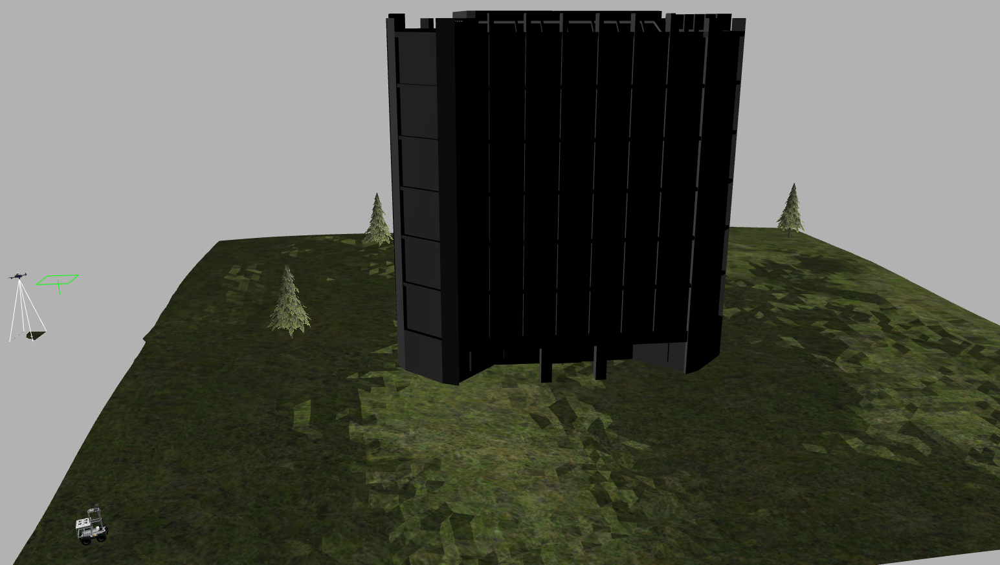

# ground_aerial_simulation

## 1. Introduction
This is a repository for ground-aerial robots simulation and it is mainly designed for testing ground-aerial collaborative SLAM. The UAV is equipped with a mid-360 LiDAR and a downward camera while the UGV is equipped with a mid-360 LiDAR and an ArUCO marker board.
<div align="center">
    
</div>

## 2. Prerequisited

### 2.1 Ubuntu and ROS

Ubuntu 20.04.  [ROS Installation](http://wiki.ros.org/ROS/Installation).

### 2.2 PCL && Eigen && OpenCV

PCL>=1.8, Follow [PCL Installation](https://pointclouds.org/). 

Eigen>=3.3.4, Follow [Eigen Installation](https://eigen.tuxfamily.org/index.php?title=Main_Page).

OpenCV>=4.2, Follow [Opencv Installation](http://opencv.org/).

### 2.3 PX4-Autopilot

Follow [PX4 Installation](https://github.com/PX4/PX4-Autopilot.git).

### 2.4 Other dependencies

Follow the instructions of these repositories:
[Livox_laser_simulation Installation](https://github.com/Livox-SDK/livox_laser_simulation),
[Scout_simulation Installation](https://github.com/ADDA-acx/scout_gazebo).
## 3. Build

Clone the repository and catkin_make:

```
cd ~/catkin_ws/src
git clone https://github.com/Yangrlan/ground_aerial_simulation
cd ../
catkin build
source ~/catkin_ws/devel/setup.bash
```

## 4. Move the robots

Firstly launch the Gazebo environment:

```
roslaunch scout_gazebo ground_aerial_gazebo.launch
```
Then move the UGV by publishing the command:

```
rostopic pub /cmd_vel geometry_msgs/Twist "linear:
  x: 0.2
  y: 0.0
  z: 0.0
angular:
  x: 0.0
  y: 0.0
  z: 0.0"
```

Let the UAV takeoff:

```
rosrun offboard_py offb_node.py
```

## 5. ArUco Detection

Before the detection, follow the instructions of this blog to add the ArUco marker picture to the Gazebo materials:
[ArUco_edit](https://blog.csdn.net/zhaohaowu/article/details/123363895).

Begin the ArUco detection:

```
roslaunch aruco_detection aruco_detection.launch
```

Noted that if you use your own marker, you should update the parameters `markerLengths` and `markerIds` in `aruco_detection/config/params.json` folder.
## 6. Simultaneous Localization and Mapping

You can also run the SLAM algorithms using the pointcloud and IMU topics published by the UAV and UGV.
